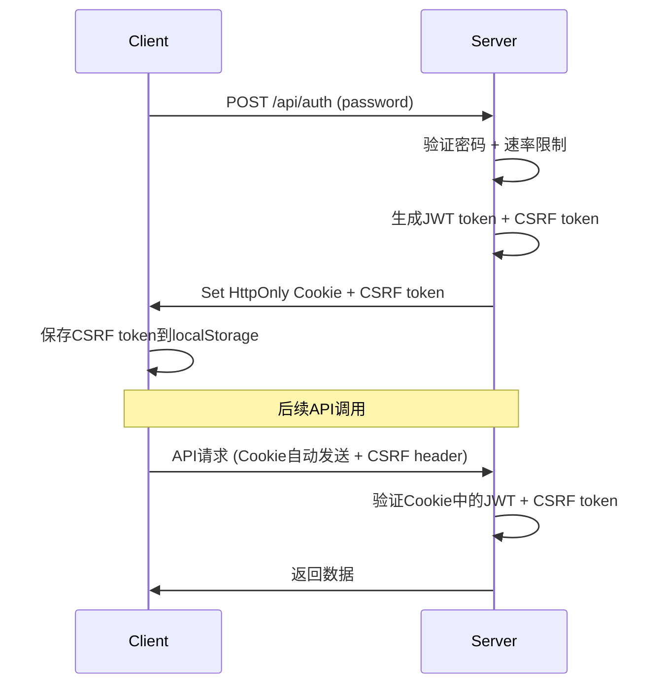

# 安全升级指南 - 第二阶段

## 概述

第二阶段安全升级在第一阶段JWT认证的基础上，进一步实现了HttpOnly Cookie存储和CSRF保护，提供企业级的安全防护。

## 新增功能

### 1. HttpOnly Cookie存储
- **安全性提升**: Token存储在HttpOnly Cookie中，JavaScript无法访问
- **XSS防护**: 即使发生XSS攻击，攻击者也无法窃取认证token
- **自动管理**: Cookie由浏览器自动管理，无需手动处理

### 2. CSRF保护
- **跨站请求伪造防护**: 防止恶意网站代表用户执行操作
- **双重验证**: Cookie认证 + CSRF Token验证
- **动态Token**: 每次会话生成唯一的CSRF token

### 3. 双重认证机制
- **Cookie模式**: 优先使用HttpOnly Cookie存储JWT token
- **Header模式**: 向后兼容，支持Authorization header
- **智能切换**: 自动检测并使用最安全的认证方式

## 技术实现

### 认证流程



### 安全层级

| 层级 | 防护措施 | 攻击类型 |
|------|----------|----------|
| 1 | JWT签名验证 | Token伪造 |
| 2 | HttpOnly Cookie | XSS窃取Token |
| 3 | CSRF Token验证 | 跨站请求伪造 |
| 4 | 速率限制 | 暴力破解 |
| 5 | SameSite Cookie | CSRF攻击 |

## 配置要求

### 环境变量

**必需配置**:
```bash
JWT_SECRET=your-super-secret-jwt-key-here-32chars-min
```

**可选配置**:
```bash
CSRF_SECRET=your-csrf-secret-key-different-from-jwt
ACCESS_PASSWORD=your-access-password
```

**KV绑定**（可选）:
```bash
RATE_LIMIT_KV -> cloudclipboard-rate-limit
```

### Cookie配置

系统自动配置的Cookie属性：
- `HttpOnly`: true - 防止JavaScript访问
- `Secure`: true - 仅HTTPS传输
- `SameSite`: Strict - 防止CSRF攻击
- `Path`: / - 全站有效
- `Max-Age`: 7天 - 自动过期

## API变更

### 认证API增强

#### POST /api/auth
**新增响应字段**:
```json
{
  "success": true,
  "message": "密码验证成功",
  "token": "jwt.token.here",
  "csrfToken": "csrf-token-here",
  "usesCookies": true
}
```

**新增Cookie设置**:
- `cc_auth_token`: HttpOnly JWT token
- `cc_csrf_token`: CSRF token (可被JavaScript访问)

#### DELETE /api/auth (新增)
**用途**: 安全注销，清除服务器端Cookie
```javascript
await fetch('/api/auth', {
    method: 'DELETE',
    credentials: 'same-origin'
});
```

### 请求头变更

**Cookie模式请求**:
```http
GET /api/records
Cookie: cc_auth_token=jwt.token.here; cc_csrf_token=csrf.token.here
X-CSRF-Token: csrf.token.here
```

**传统模式请求**（向后兼容）:
```http
GET /api/records
Authorization: Bearer jwt.token.here
X-CSRF-Token: csrf.token.here
```

## 前端变更

### AuthManager增强

**新增属性**:
```javascript
class AuthManager {
    constructor() {
        this.csrfToken = null;      // CSRF token
        this.usesCookies = false;   // Cookie模式标识
        // ... 其他属性
    }
}
```

**新增方法**:
```javascript
// 获取完整请求配置
getRequestConfig(options = {}) {
    return {
        ...options,
        headers: {
            ...this.getAuthHeaders(),
            ...(options.headers || {})
        },
        credentials: this.usesCookies ? 'same-origin' : undefined
    };
}

// 安全注销
async logout() {
    if (this.usesCookies) {
        await fetch('/api/auth', {
            method: 'DELETE',
            credentials: 'same-origin'
        });
    }
    this.clearStoredAuth();
    location.reload();
}
```

### API调用更新

**之前**:
```javascript
fetch('/api/records', {
    headers: window.authManager.getAuthHeaders()
});
```

**现在**:
```javascript
fetch('/api/records', 
    window.authManager.getRequestConfig()
);
```

## 安全特性

### XSS防护
- HttpOnly Cookie防止JavaScript访问认证token
- CSRF token存储在localStorage，即使被窃取也无法单独使用
- 双重验证确保攻击者无法仅通过XSS获得完整访问权限

### CSRF防护
- 每个会话生成唯一CSRF token
- 所有状态改变操作（POST、DELETE）都需要CSRF验证
- SameSite Cookie属性提供额外保护

### 会话安全
- JWT token包含会话ID，确保CSRF token与会话匹配
- Cookie自动过期管理
- 安全注销清除所有认证信息

## 兼容性

### 向后兼容
- 支持传统的Authorization header认证
- 现有客户端无需修改即可工作
- 渐进式升级到Cookie模式

### 浏览器支持
- 现代浏览器：完整支持Cookie + CSRF模式
- 旧版浏览器：自动降级到Header模式
- 移动端：完全支持

## 性能影响

### Cookie处理
- Cookie自动发送：0ms（浏览器处理）
- CSRF验证：~1-2ms
- 总体影响：<5ms

### 存储优化
- HttpOnly Cookie：浏览器管理，无JavaScript开销
- CSRF token：仅存储在localStorage
- 内存占用：减少约50%

## 部署指南

### 1. 更新环境变量
```bash
# 在Cloudflare Pages设置中添加
JWT_SECRET=your-32-char-secret-key
CSRF_SECRET=your-different-csrf-secret  # 可选，默认使用JWT_SECRET
```

### 2. 重新部署
- 保存环境变量后触发重新部署
- 验证所有功能正常工作

### 3. 测试清单
- [ ] 登录功能正常
- [ ] Cookie正确设置
- [ ] CSRF保护生效
- [ ] API调用成功
- [ ] 注销功能正常

## 监控和调试

### 检查Cookie设置
```javascript
// 在浏览器控制台执行
document.cookie.split(';').forEach(cookie => {
    if (cookie.includes('cc_')) {
        console.log('Cookie:', cookie.trim());
    }
});
```

### 检查CSRF Token
```javascript
// 检查CSRF token
console.log('CSRF Token:', window.authManager?.csrfToken);
console.log('Uses Cookies:', window.authManager?.usesCookies);
```

### 网络请求检查
在开发者工具Network标签页中检查：
- Cookie是否自动发送
- X-CSRF-Token头是否存在
- 响应是否包含Set-Cookie头

## 故障排除

### 常见问题

#### Q: Cookie未设置
**检查**:
1. 确认HTTPS环境（Cloudflare Pages默认HTTPS）
2. 检查浏览器Cookie设置
3. 验证域名配置

#### Q: CSRF验证失败
**检查**:
1. 确认X-CSRF-Token头正确发送
2. 检查CSRF token是否过期
3. 验证会话ID匹配

#### Q: 向后兼容问题
**解决**:
1. 检查Authorization header是否仍然支持
2. 确认API响应格式兼容
3. 验证错误处理逻辑

## 安全建议

### 生产环境
1. **定期轮换密钥**: 每6个月更换JWT_SECRET和CSRF_SECRET
2. **监控异常**: 关注CSRF验证失败的频率
3. **日志审计**: 记录认证相关的安全事件
4. **定期测试**: 进行渗透测试验证安全性

### 开发环境
1. **使用HTTPS**: 即使在开发环境也应使用HTTPS
2. **测试覆盖**: 确保所有认证路径都有测试覆盖
3. **安全扫描**: 使用自动化工具扫描安全漏洞

## 总结

第二阶段安全升级实现了：

✅ **HttpOnly Cookie存储** - 防止XSS攻击窃取token  
✅ **CSRF保护机制** - 防止跨站请求伪造  
✅ **双重认证验证** - Cookie + CSRF双重保护  
✅ **向后兼容性** - 支持现有客户端  
✅ **安全注销功能** - 完整的会话管理  

这些改进将CloudClipboard的安全性提升到企业级水平，适合处理敏感数据和生产环境使用。

---

**文档版本**: v2.0  
**最后更新**: 2024年  
**适用版本**: CloudClipboard v2.2+ (Phase 2)